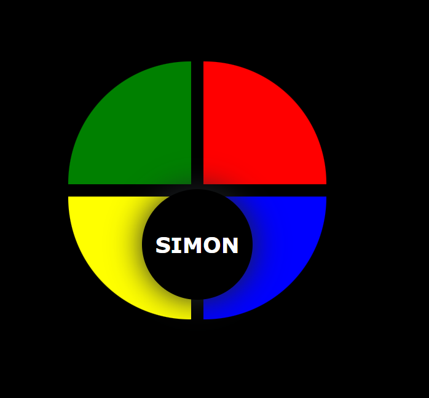

# Simon Says Game

This is a simple version of the Simon Says Game using HTML, CSS, and JavaScript. The game involves a sequence of colored buttons that the player must repeat. As the game progresses, the sequence gets longer, and the player must remember the entire sequence.

## Features: 

- A sequence of colors is shown, and the player must repeat it.
- The sequence length increases with each round.
- The game ends when the player makes a mistake in the sequence. 
- Animated button clicks and the sequence fades.
- A restart function is available after a mistake.

## Techonlogies Used:

- HTML fo the basic structure. 
- CSS for styling and button animations
- JavaScript for game logix and interactions

## Setup

1. Clone or donwload the repository
2. Open 'index.html' in a web browser

